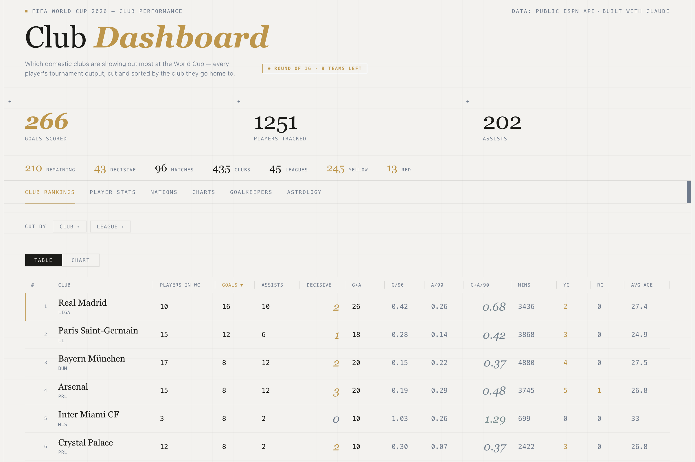
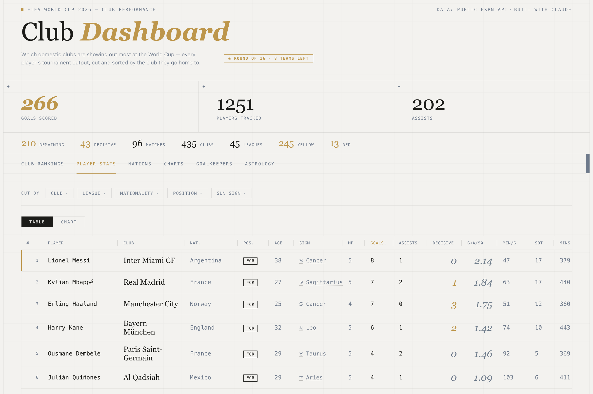
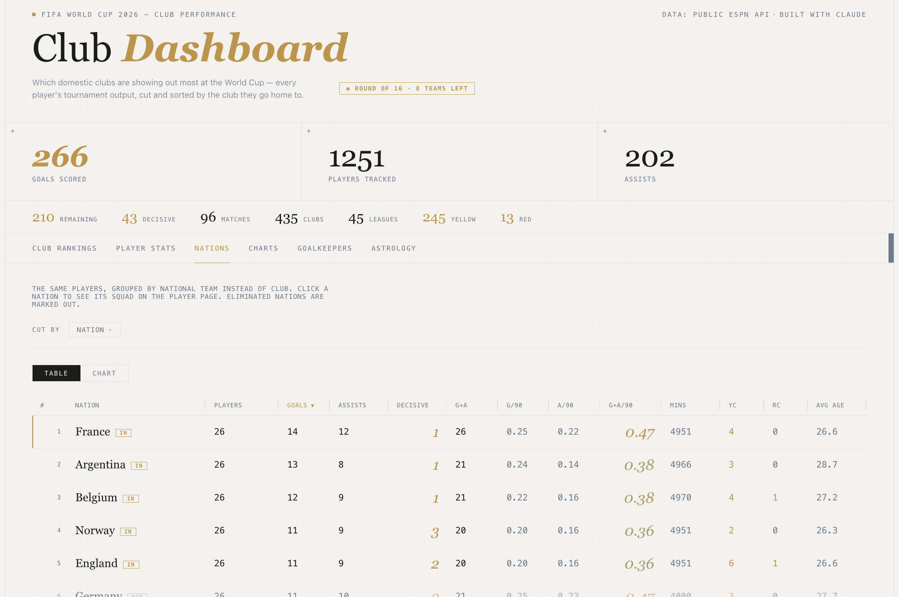
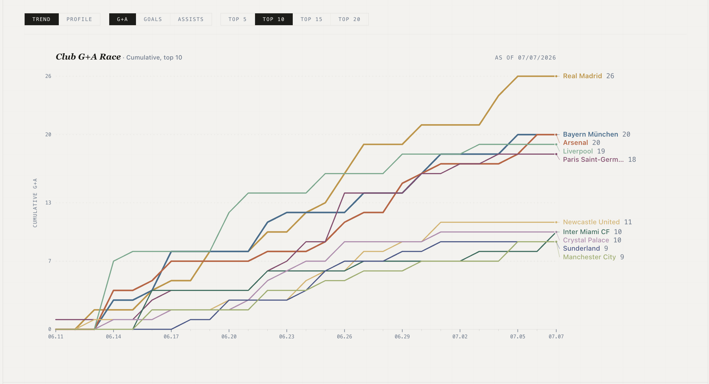
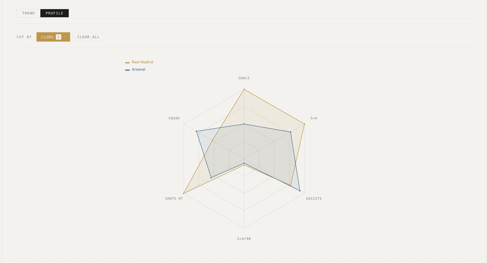
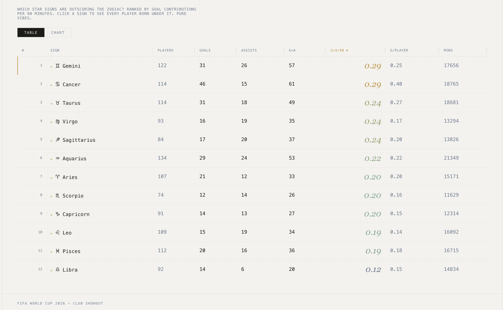

# FIFA World Cup 2026 — Club Showout

### ▶ [**clubshowout.vercel.app/wc2026**](https://clubshowout.vercel.app/wc2026)

Which **domestic clubs** are showing out most at the World Cup? Every player's tournament
output — goals, assists, decisive goals, minutes, cards — cut and sorted by the club they
go home to. Auto-updated from live match data throughout the tournament.



---

## The dashboard

**Six lenses on the same data**, each sortable, filterable, and switchable between a
table and a chart.

#### Player stats & decisive goals
Rank every player by goals, assists, G+A/90 — and **decisive goals**: the game-winners
and rescuing equalizers that actually changed a result.



#### Nations — and who's still standing
The same players regrouped by national team, with live **IN / OUT** elimination status
derived from the knockout bracket. Eliminated nations dim out; the header tracks the
current round and teams remaining.



#### The G+A race
A cumulative goal-contribution race across the tournament, direct-labelled and built to
read cleanly as a screenshot.



#### Club profiles & astrology
A radar to compare any two clubs across six axes — plus a tongue-in-cheek look at which
**star signs** are outscoring the zodiac.




---

## Architecture

```
ESPN public API ──▶ Python pipeline ──▶ wc2026.json ──▶ Next.js app ──▶ Vercel
                    (fetch + transform)   (committed)     (API + UI)
        ▲                                                      
        └──────────── GitHub Actions cron (per kickoff slot) ──┘
```

- **Data pipeline** — Python fetches box scores, key events, and squads from ESPN's
  public API, then derives real minutes, decisive goals, and elimination status into a
  single `wc2026.json`.
- **Frontend** — Next.js reads that JSON through thin `/api/v1/*` routes; all tables,
  filters, and charts (hand-built SVG) render client-side.
- **Automation** — a GitHub Actions cron runs ~150 min after each kickoff slot, commits
  refreshed data, and triggers a Vercel redeploy. The site keeps itself current with zero
  manual steps.

## Stack

**Python** · **Next.js** · **TypeScript** · **Vercel** · **GitHub Actions** · ESPN public API
