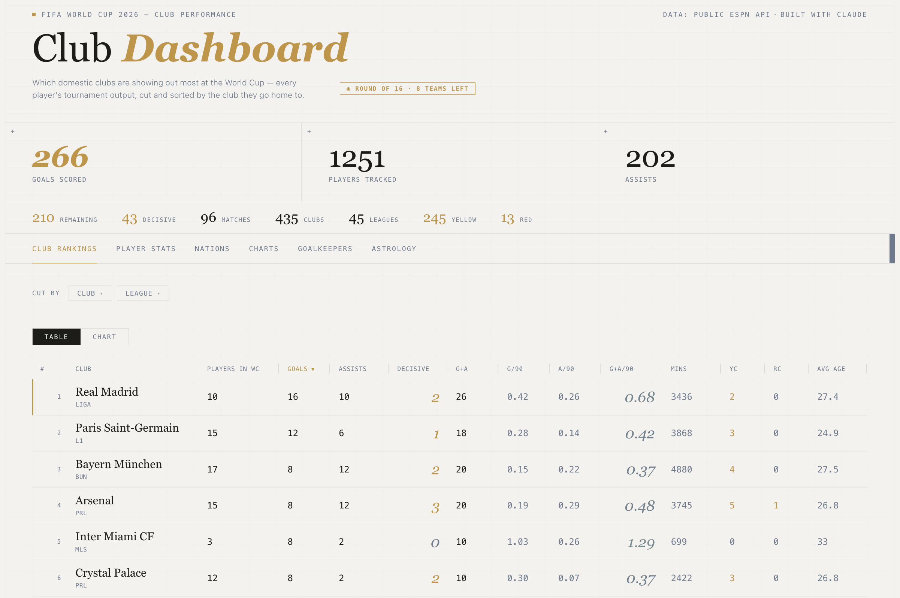
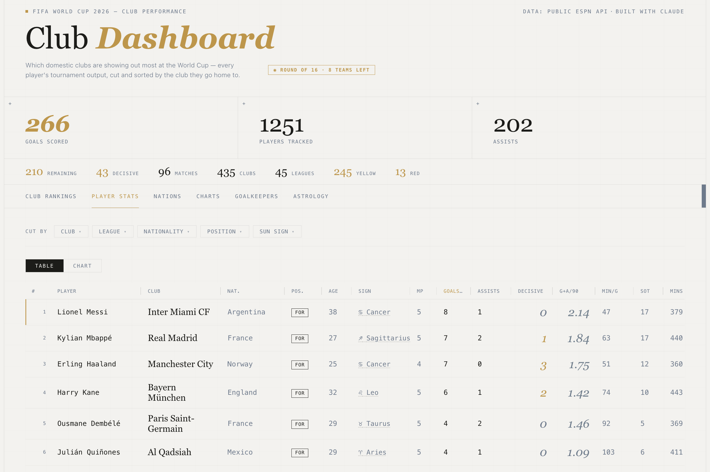
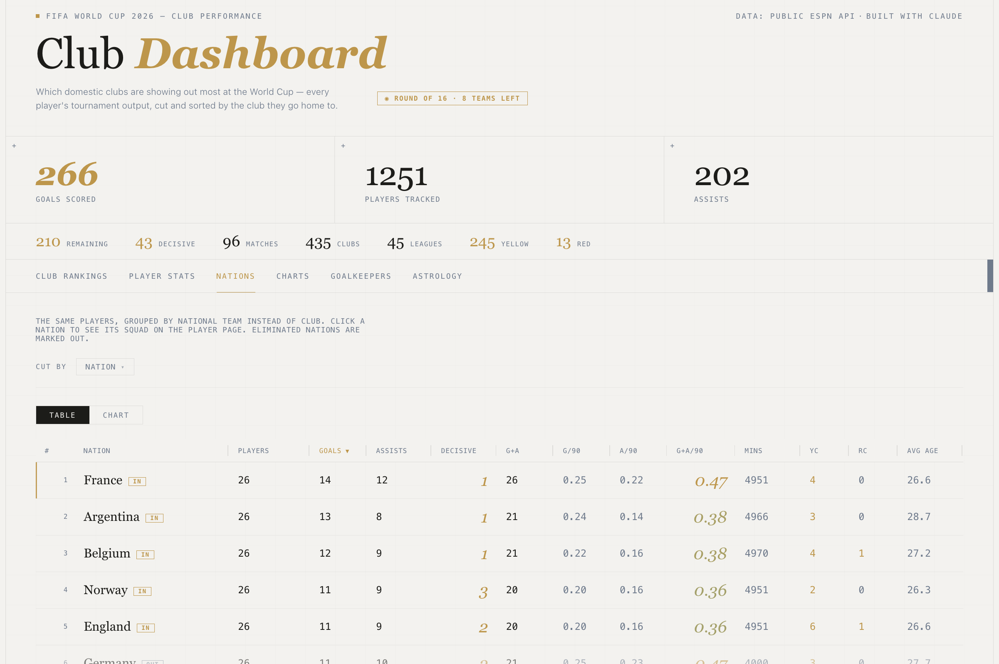
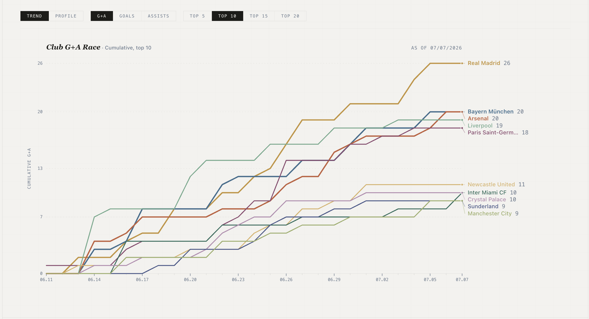
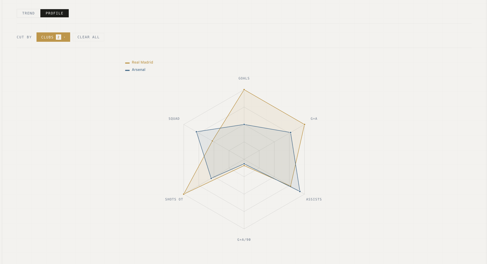
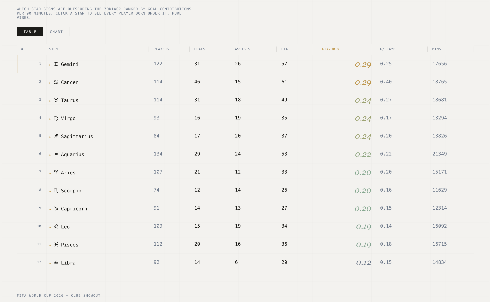

# FIFA World Cup 2026 — Club Showout

### ▶ [**clubshowout.vercel.app/wc2026**](https://clubshowout.vercel.app/wc2026)

Which **domestic clubs** are showing out most at the World Cup? Every player's tournament
output — goals, assists, decisive goals, minutes, cards — cut and sorted by the club they
go home to. Auto-updated from live match data throughout the tournament.



---

## The dashboard

**Six lenses on the same data**, each sortable, filterable, and switchable between a
table and a chart.

#### Player stats & decisive goals
Rank every player by goals, assists, G+A/90 — and **decisive goals**: the game-winners
and rescuing equalizers that actually changed a result.



#### Nations — and who's still standing
The same players regrouped by national team, with live **IN / OUT** elimination status
derived from the knockout bracket. Eliminated nations dim out; the header tracks the
current round and teams remaining.



#### The G+A race
A cumulative goal-contribution race across the tournament, direct-labelled and built to
read cleanly as a screenshot.



#### Club profiles & astrology
A radar to compare any two clubs across six axes — plus a tongue-in-cheek look at which
**star signs** are outscoring the zodiac.




---

## International breaks — [`/intl`](https://clubshowout.vercel.app/intl)

The same club lens applied to every FIFA window after the World Cup (friendlies,
Nations League, qualifiers): which clubs' players got minutes, what they produced, and
**who came back injured**.

- `python scripts/fetch_intl.py` scans each window in `scripts/intl/config.py`
  (check dates against FIFA's calendar; add new windows there) and writes
  `data/intl/intl.json`, mirrored to `web/data/intl.json`.
- Injuries come from three sources, shown together in the Injuries tab:
  **match** (ESPN commentary: subbed off injured / treated on the pitch),
  **profile** (injury status on the player's ESPN profile, where ESPN has one), and
  **manual** (`data/intl/injuries_manual.json`, for camp withdrawals and club-confirmed
  diagnoses).
- Clubs are re-read from player profiles every 14 days, so summer transfers are reflected.
  The World Cup data and caches are never touched.
- Run it from the **Fetch International Break Data** workflow (manual trigger).

## Architecture

```
ESPN public API ──▶ Python pipeline ──▶ JSON files  ──▶ Next.js app ──▶ Vercel
                    (fetch + transform)   (committed)     (API + UI)
        ▲                                                      
        └──────────── GitHub Actions (run on demand) ───────────┘
```

- **Data pipeline** — Python fetches box scores, key events, and squads from ESPN's
  public API, then derives real minutes, decisive goals, and elimination status into a
  single `wc2026.json`.
- **Frontend** — Next.js reads that JSON through thin `/api/v1/wc2026/*` routes (old
  `/api/v1/*` paths still work via rewrites); all tables,
  filters, and charts (hand-built SVG) render client-side.
- **Automation** — the **Fetch WC 2026 Data** and **Fetch International Break Data** GitHub
  Actions workflows (run from the Actions tab) commit refreshed data, which triggers a
  Vercel redeploy. The World Cup is over, so only the break workflow needs running, once
  per FIFA window.

## Layout

Each competition is self-contained; shared code lives in `core` / `components`.

```
scripts/
  core/            ESPN client, match parsing, athlete profiles, league names, paths
  wc2026/          World Cup config, fetch, transform     → python scripts/fetch_wc2026.py
  intl/            International-break config + fetch     → python scripts/fetch_intl.py
data/
  wc2026/          WC pipeline caches (frozen — tournament is over)
  intl/            break caches + injuries_manual.json
web/
  app/page.tsx     home: links to both dashboards
  app/wc2026/      World Cup dashboard           app/api/v1/wc2026/*
  app/intl/        International-break dashboard app/api/v1/intl
  components/      FilterBar, Tooltip, MetricChart, motion, column resize, dashboard.module.css
  lib/stores/      one data reader per competition (wc2026.ts, intl.ts)
  data/            wc2026.json, intl.json (pipeline output the app reads)
```

Adding a new competition = a `scripts/<name>/` package + `data/<name>/` + `web/app/<name>/`
+ `web/lib/stores/<name>.ts`, reusing `core` and `components`.

## Stack

**Python** · **Next.js** · **TypeScript** · **Vercel** · **GitHub Actions** · ESPN public API
